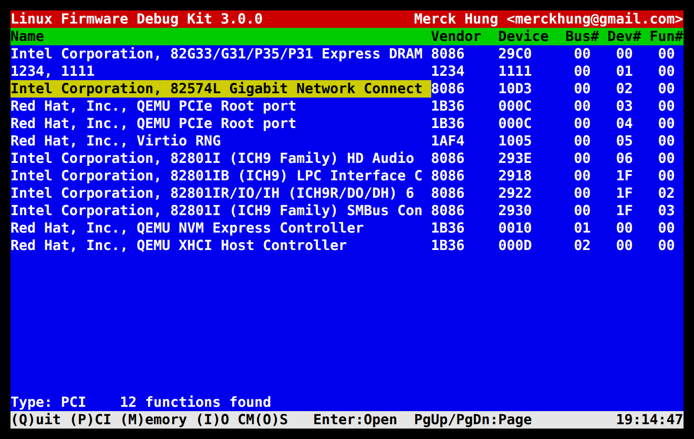
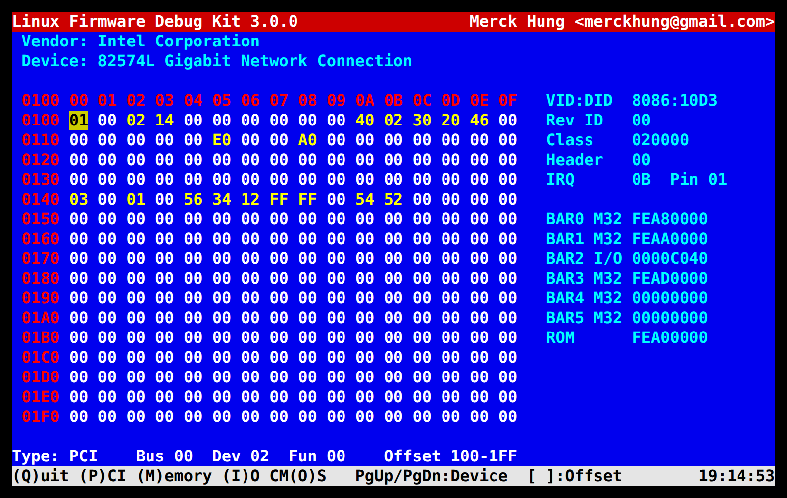
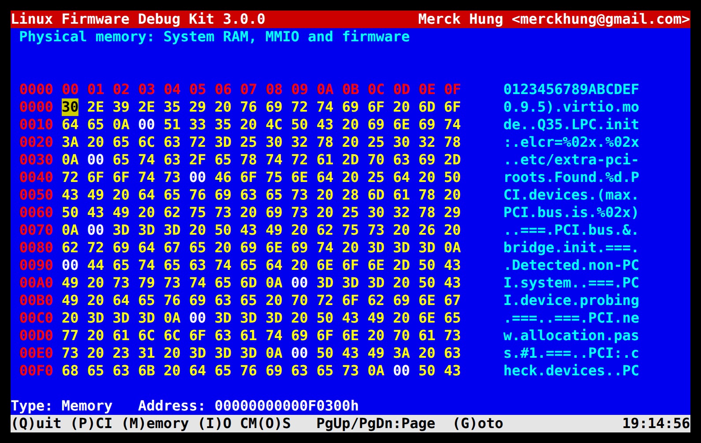
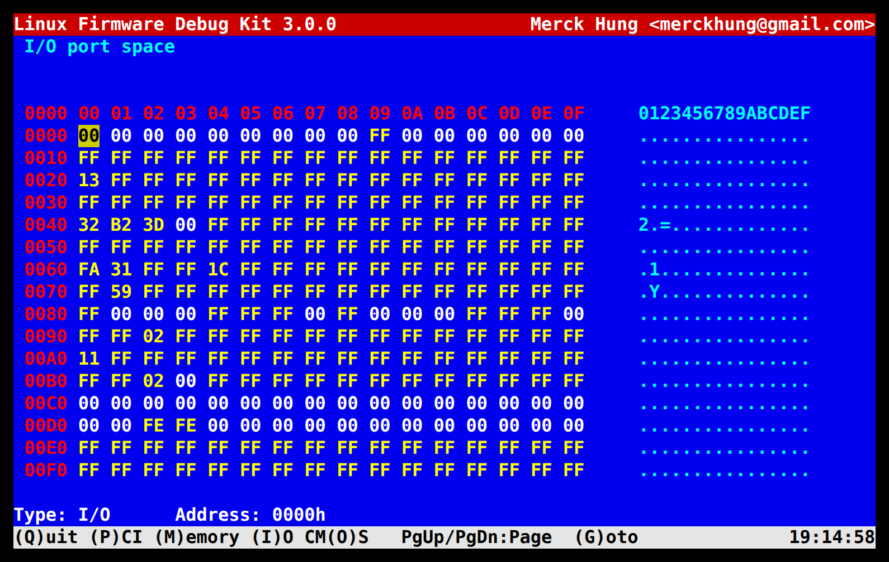
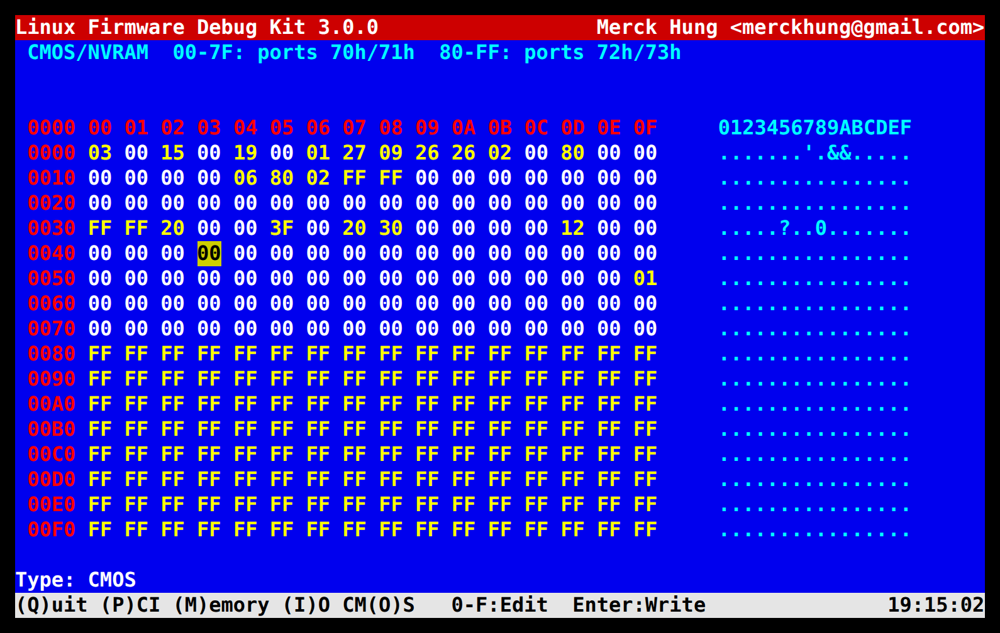

# LFDK — Linux Firmware Debug Kit

LFDK is a BIOS-setup-style, full-screen hardware debugger for Linux. It lets
firmware, BIOS and driver developers inspect **and edit** low-level hardware
state from a running system:

- **PCI / PCI Express configuration space**: every function on every bus,
  including the 4 KiB PCIe extended space.
- **Physical memory**: System RAM, MMIO registers and firmware regions.
- **I/O ports**: the whole 64 KiB x86 I/O space.
- **CMOS / NVRAM**: the standard and the extended RTC banks.

It has two parts:

| Component | Directory | Description |
| --- | --- | --- |
| **LFDD** (Linux Firmware Debug Driver) | [`lfdd/`](lfdd) | Kernel module that exposes `/dev/lfdd` and performs the hardware accesses. |
| **LFDK** (Linux Firmware Debug Kit) | [`lfdk/`](lfdk) | ncurses front end that talks to `/dev/lfdd`. |

> [!WARNING]
> LFDK writes directly to hardware. A wrong byte in a PCI register, an MMIO
> region or CMOS can hang the machine, corrupt data or leave the firmware
> unbootable. Use it on development and test systems only.

## Screenshots

These were captured from LFDK 3.0.0 running on **Linux 7.2** in a QEMU `q35`
virtual machine.

**PCI device list** — every function found on the scanned buses, with names
from the bundled PCI ID database.



**PCI configuration space** — the 256-byte header as an editable hex grid, with
the decoded IDs, class code, IRQ, BARs and expansion ROM on the right.


**PCI Express extended configuration space** — press `]` / `[` to page
through offsets `0x100`-`0xFFF`; here the AER (`0x100`) and Device Serial
Number (`0x140`) capabilities of an 82574L NIC.



**Physical memory** — here part of the SeaBIOS image in the legacy BIOS area
at `0xF0300`, with an ASCII column.



**I/O ports** — here ports `0x0000`-`0x00FF` (legacy DMA, PIC, PIT and
keyboard controller).



**CMOS / NVRAM** — the RTC time registers update live.



## Requirements

- Linux **7.x** (developed and tested on 7.2, x86-64).
- Kernel headers or a configured kernel tree for the running kernel
  (`linux-headers-$(uname -r)` on Debian/Ubuntu, `kernel-devel` on Fedora).
- `gcc`, `make` and the ncurses development package (`libncurses-dev` or
  `ncurses-devel`).
- Root, or at least `CAP_SYS_RAWIO`.

The CMOS view is x86 specific, and the I/O port view needs an architecture
with port I/O. Elsewhere those views report "Operation not supported".

## Build

```sh
make                     # builds lfdd/lfdd.ko and lfdk/lfdk, copies both to bin/
make KDIR=/path/to/linux # builds the module against another kernel tree
```

The parts can also be built on their own:

```sh
make -C lfdd              # kernel module only
make -C lfdk              # user-space tool only
make -C lfdk STATIC=1     # statically linked tool, handy for an initramfs
```

## Usage

```sh
sudo insmod bin/lfdd.ko   # creates /dev/lfdd (mode 0600)
sudo bin/lfdk
sudo rmmod lfdd
```

To install the tool and its PCI ID database under `/usr/local`:

```sh
sudo make install         # or: make -C lfdk install PREFIX=/opt/lfdk
```

### Command line

```text
lfdk [-h] [-d /dev/lfdd] [-n pci.ids] [-b 255]
  -d  Device node of the lfdd driver (default /dev/lfdd)
  -n  PCI ID database (default: bundled, then system copy)
  -b  Highest PCI bus number to scan (default 255)
  -h  Print this message
```

Without `-n`, LFDK uses the first `pci.ids` it finds in:
`$(PREFIX)/share/lfdk/`, the directory of the `lfdk` binary,
`/usr/share/hwdata/` and `/usr/share/misc/`.

The terminal must be at least 80×24.

### Keys

| Key | Where | Action |
| --- | --- | --- |
| `P` | anywhere | PCI device list |
| `M` | anywhere | Physical memory (prompts for an address) |
| `I` | anywhere | I/O ports (prompts for a port) |
| `O` | anywhere | CMOS / NVRAM |
| `Q` | anywhere | Quit |
| `↑` `↓` | PCI list | Move the selection |
| `PgUp` `PgDn` | PCI list | Previous / next page |
| `Enter` | PCI list | Open the selected function |
| `PgUp` `PgDn` | PCI device | Previous / next function |
| `[` `]` | PCI device | Previous / next 256-byte window of the 4 KiB config space |
| `PgUp` `PgDn` | memory, I/O | Previous / next 256 bytes |
| `G` | memory, I/O | Go to an address |
| `←` `↑` `→` `↓` | hex grid | Move the cursor |
| `0`-`9` `A`-`F` | hex grid | Type a new value (it blinks while pending) |
| `Enter` | hex grid | Write the pending value |
| `Esc` | hex grid | Discard the pending value |

When asked for an address, type hex digits (the first digit replaces the old
address; `Backspace` deletes a digit) and press `Enter`. Screens are
refreshed ten times a second, so live registers update on their own.

## How it works

`lfdd` registers the `/dev/lfdd` misc device. Opening it requires
`CAP_SYS_RAWIO` and is refused while the kernel is in
[lockdown](https://man7.org/linux/man-pages/man7/kernel_lockdown.7.html),
the same policy as `/dev/mem`. The ioctl interface is defined in
[`lfdd/lfdd_ioctl.h`](lfdd/lfdd_ioctl.h), which both the module and the tool
include:

| Space | Commands | Backend |
| --- | --- | --- |
| PCI / PCIe | `LFDD_PCI_READ`, `LFDD_PCI_WRITE`, `LFDD_PCI_READ_BLOCK` | `pci_bus_{read,write}_config_*()` on the bus from `pci_find_bus()`, so accesses are serialized with the PCI core and use ECAM/MMCONFIG where available. |
| Memory | `LFDD_MEM_READ`, `LFDD_MEM_WRITE`, `LFDD_MEM_READ_BLOCK` | Each page is classified with `region_intersects()`. System RAM is read with `copy_from_kernel_nofault()` and written through a temporary `vmap()` alias; everything else goes through `ioremap()`. |
| I/O | `LFDD_IO_READ`, `LFDD_IO_WRITE`, `LFDD_IO_READ_BLOCK` | `inb/w/l()`, `outb/w/l()`. |
| CMOS | `LFDD_CMOS_READ`, `LFDD_CMOS_WRITE`, `LFDD_CMOS_READ_BLOCK` | `CMOS_READ()`/`CMOS_WRITE()` under `rtc_lock` for `0x00`-`0x7F`; ports `0x72`/`0x73` for `0x80`-`0xFF`. |

Single accesses take a `width` of 1, 2 or 4 bytes. Block reads return 256
bytes. Addresses that cannot be accessed (missing PCI functions, buses the
kernel did not enumerate, holes in the physical address space) read back as
`0xFF`.

## Updating the PCI ID database

`lfdk/pci.ids` is a snapshot of the [PCI ID Repository](https://pci-ids.ucw.cz/)
(version 2026.09.25). To refresh it:

```sh
make update-pciids
```

## Changes in 3.0.0

- Ported the driver to Linux 7.x: Kbuild `obj-m`/`lfdd-y`, `<linux/uaccess.h>`,
  `compat_ptr_ioctl`, a dynamic misc minor (the old fixed minor 100 could
  collide), and a `0600` device node.
- New ioctl ABI built with `_IOWR()`, fixed-size `__u*` fields and 64-bit
  physical addresses, shared by the driver and the tool.
- PCI access goes through the kernel PCI core instead of racing it on
  `0xCF8`/`0xCFC`, and supports the 4 KiB PCIe extended configuration space.
- Memory access no longer dereferences `phys_to_virt()` of arbitrary
  addresses; RAM and MMIO are mapped correctly and faults cannot oops.
- CMOS moved into the driver, so LFDK no longer needs `ioperm()`, and no
  longer toggles the NMI mask bit by writing indexes `0x80`-`0xFF` to port
  `0x70`.
- Access requires `CAP_SYS_RAWIO` and honours kernel lockdown.
- Fixed bugs: ioctls returned the number of uncopied bytes instead of
  `-EFAULT`; 16-bit memory writes truncated the value to 8 bits; the PCI
  "Int Pin" field was read from the wrong offset; the PCI list overflowed
  after 50 functions; the timer and screen were redrawn in a 1 ms busy loop.
- Removed the debug `printk()`s, and the unused I2C and duplicate PCIe stubs.
- Rewrote LFDK on plain ncurses (no panel library), with one hex editor shared
  by all views, decoded BARs, a faster single-pass `pci.ids` lookup and a
  current PCI ID database.
- Reformatted all C sources to the Google C++ style (`.clang-format`).

## Development

The code follows the [Google C++ Style Guide](https://google.github.io/styleguide/cppguide.html)
formatting, enforced with clang-format:

```sh
make format
```

## License

GNU General Public License, version 2. See the header of each source file.

Copyright © 2006 – 2026 Merck Hung &lt;merckhung@gmail.com&gt;
